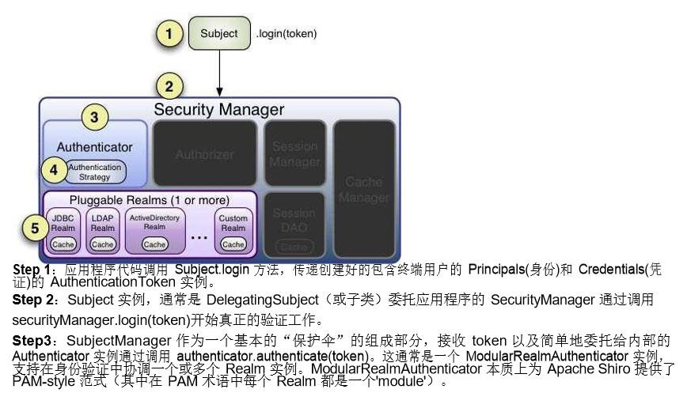

# Apache Shiro
## 一、 简介
`Apache Shiro` 是一个强大而灵活的开源安全框架，它干净利落地处理身份认证，授权，企业会话管理和加密。 

以下是你可以用`Apache Shiro` 所做的事情 :

+ 验证用户来核实他们的身份 
+ 对用户执行访问控制，如：
  + 判断用户是否被分配了一个确定的安全角色 
  + 判断用户是否被允许做某事 
+ 在任何环境下使用 `Session API`，即使没有 `Web` 或 `EJB` 容器
+ 在身份验证，访问控制期间或在会话的生命周期，对事件作出反应
+ 聚集一个或多个用户安全数据的数据源，并作为一个单一的复合用户“视图”
+ 启用单点登录（`SSO`）功能
+ 为没有关联到登录的用户启用`Remember Me`服务
+ 其他
## Shiro quickstart demo
1. pom文件配置
```xml
<!--shiro core-->
<dependency>
    <groupId>org.apache.shiro</groupId>
    <artifactId>shiro-core</artifactId>
    <version>1.4.1</version>
</dependency>

<!--shiro spring-->
<dependency>
    <groupId>org.apache.shiro</groupId>
    <artifactId>shiro-spring</artifactId>
    <version>1.4.1</version>
</dependency>
```

2. shiro配置
```ini
[users]
admin=123456
```
3. ShiroTest.java测试
```java
public void loginTest(){
// 1.创建SecurityManager的工厂,这里使用 init文件初始化
Factory<org.apache.shiro.mgt.SecurityManager> factory = new IniSecurityManagerFactory("shiro.ini");
// 2.获得SecurityManager的实例,并绑定给SecurityUtils
SecurityManager securityManager = factory.getInstance();
SecurityUtils.setSecurityManager(securityManager);
// 3.
Subject subject = SecurityUtils.getSubject();
// 登录
String username = "admin";
String password = "123456";
UsernamePasswordToken token = new UsernamePasswordToken(username,password);
try{
subject.login(token);
}catch(...){}
// exceptions
}
// 断言认证成功
Assert.assertEquals(true,subject.isAuthenticated());
```
## Shiro架构
+ Subject : 主体,用户
+ Realms : 域,类似DAO,获取数据源信息进行认证,授权
+ SecurityManger : 安全管理器,shiro的核心
+ **Authentication** : 身份认证或登录
+ **Authorization** : 授权,授予权限才能访问
+ **Session Management** : 用户会话管理
  + SessionDAO : 代表 SessionManager 执行 Session 持久化（CRUD）操作
+ **Cryptography** : 加密数据
+ CacheManager : 缓存管理

### Authentication认证
是指身份验证的过程,通过提交用户的身份和凭证给 Shiro，以判断它们是否和应用程序预期的相匹配。 

+ Principals : 身份,证明Subject的东西,对于应用程序来说是唯一的,如用户名或电子邮件等
  + Primary Principal : 指单一,确切的值
+ Credentials : 凭证,如密码

**Stept1 :** 收集Subject的 Principals(身份)和 Credentials(凭证)；

```java
// 一般通过UsernamePasswordToken收集
UsernamePasswordToken token = new UsernamePasswordToken(username,password)
token.setRememberMe(true);
```
**Step 2 :**提交 Subject 的 Principals(身份)和 Credentials(凭证) 
```java
Subject currentUser = SecurityUtils.getSubject();
currentUser.login(token);
```

**Step3 :**处理成功或失败

```java
try{
currentUser.login(token);
} catch ( UnknownAccountException uae ){
//
} catch ( IncorrectCredentialsException ice ) {
//
} catch (LockedAccountException lae ) {
//
} catch (ExcessiveAttemptsException eae ) {
//
} catch ( your own …exceptions){
//
} catch ( AuthenticationException ae ) {
//unexpected error? 
} 
// login successfully
```
#### 认证流程


#### Remembered & Authenticated比较
+ Remembered(记住我) 
  + 一个记住我的 Subject 不是匿名的，
  + 而且有一个已知的身份 ID（也就是 subject.getPrincipals()是非空的）。
  + 但是这个被记住的身份 ID 是在之前的 session 中被认证的。
  + 如果 subject.isRemembered()返回 true，则 Subject 被认为是被记住的 
+ Authenticated(已认证) : 
  + 一个已认证的 Subject 是指在当前 Session 中被成功地验证过了
  + 也就是说，login 方法被调用并且没有抛出异常
  + 如果 subject.isAuthenticated()返回 true 则认为 Subject 已通过验证。  

> Mutually Exclusive Relationship(互斥关系)
>  Remembered 和 Authenticated 是互斥的,若其中一个为真则另一个为假，反之亦然

**理解用例:**
你正在公司电脑登录自己的Amazon.com,选了几本书籍加入购物车,这时你突然要去开会,会议结束,忘记注销/退出,下班直接回家.

第二天,意思到还没购买书籍,打开Amazon,由于第一次"记住我",可以继续操作,对于Amazon来说,subject.isRemembered() 将返回 true。

但是当你想要访问账户修改信用卡信息来支付购买账单时,尽管amazon记住你(isRemembered() == true),它无法保证你就是实际的你(可能是你的同事在操作),
所以在执行敏感操作时,amazon强制让你登录,来核实你的身份,同时对 Amazon 而言，isAuthenticated()现在返回是 true

#### 注销
调用logout()方法,注销登录,任何现有的 Session 都将会失效，而且任何身份都将会失去关联（例如，在 Web 应用程序 中，RememberMe cookie 也将被删除）。 

由于在 Web 应用程序记住身份往往是依靠 Cookies，然而 Cookies 只能在 Response 被 committed 之前被删除，所以强烈建议在调用 subject.logout()后立即将终端用户重定向到一个新的视图或页面。 这样能够保证任何与安全相关的 Cookies 都能像预期的一样被删除。这是 HTTP cookies 的功能限制，而不是 Shiro 的。 
```java
currentUser.loginout();
```
### Authorization授权
授权，又称作为访问控制，是对资源的访问管理的过,即有权限操作(CRUD),如

+ 打开一个文件
+ 查看'/user/list'网页
+ 打印文档
+ 删除用户Tom

**权限 :**

+ 权限粒度
  + 粗粒度
  + 细粒度 

**角色 :**

+ 隐式角色
  
  > Role-Based Access Control(基于角色),拥有某角色就拥有权限

```java
//假设只有项目组长monitor角色,才有权限查看核心代码
if(user.hasRole("monitor)){
  //do something
}
//现在需求变更,项目经理manager角色也能查看
if(user.hasRole("monitor") || user.haoRole("manager")){
  //do something
}
//可以看出,如果角色频繁变更,代码判断逻辑也要频繁的修改
```

+ 显示角色
  
  > Resource-Based Access Control(基于资源),一个显式角色本质上是一个实际许可声明的命名集合

```java
//权限判断与角色无关,只判断是否拥有该字符权限
if(user.hasPermission("project:core:view")){
  //do something
}
/*这样用户权限变更,只需修改数据库中用户对应角色的权限,而权限与对应的资源通常不需改变
 * 基于资源方式,仍然需要角色,用户权限分配依据角色(例如:admin角色,同时会有CRUD权限)
 * 访问控制时,不判断角色,只关心是否拥有该权限,有就可访问
 * /
```

*Shiro 团队提倡使用权限和显式角色，而不是陈旧的隐式方法。你将会拥有更多的控制应用程序的安全经验*

### Realm
####  AuthenticationStrategy 策略
3种认证策略

| AuthenticationStrategy         | 描述                                                         |
| ------------------------------ | ------------------------------------------------------------ |
| `AtLeastOneSuccessfulStrategy` | 至少一个Realm 验证成功，则整体的 尝试被认为是成功的。如果没有一个验证成功，则整体尝试失败 (默认模式) |
| `FirstSuccessfulStrategy`      | 只有第一个成功地验证的 Realm 返回的信息将被使用。其他所有进一步的 Realm 将被忽略。如果没有 一个验证成功，则整体尝试失败 |
| `AllSucessfulStrategy`         | 为了整体的尝试成功，所有配置的 Realm 必须验 证成功。如果没有一个验证成功，则整体尝试失 败 |


