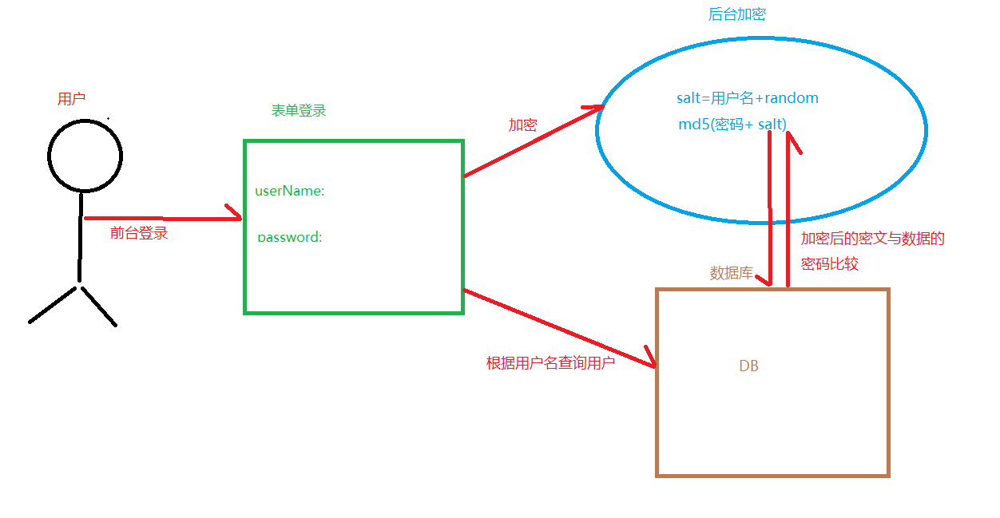

# Apache Shiro
## 一、 简介
`Apache Shiro` 是一个强大而灵活的开源安全框架，它干净利落地处理身份认证，授权，企业会话管理和加密。 

以下是你可以用`Apache Shiro` 所做的事情 :

+ 验证用户来核实他们的身份 
+ 对用户执行访问控制，如：
  + 判断用户是否被分配了一个确定的安全角色 
  + 判断用户是否被允许做某事 
+ 在任何环境下使用 `Session API`，即使没有 `Web` 或 `EJB` 容器
+ 在身份验证，访问控制期间或在会话的生命周期，对事件作出反应
+ 聚集一个或多个用户安全数据的数据源，并作为一个单一的复合用户“视图”
+ 启用单点登录（`SSO`）功能
+ 为没有关联到登录的用户启用`Remember Me`服务
+ 其他
## 二、Shiro quickstart demo
1. pom文件配置
```xml
<!--shiro core-->
<dependency>
    <groupId>org.apache.shiro</groupId>
    <artifactId>shiro-core</artifactId>
    <version>1.4.1</version>
</dependency>

<!--shiro spring-->
<dependency>
    <groupId>org.apache.shiro</groupId>
    <artifactId>shiro-spring</artifactId>
    <version>1.4.1</version>
</dependency>
```

2. shiro配置
```ini
[users]
admin=123456
```
3. ShiroTest.java测试
```java
public void loginTest(){
// 1.创建SecurityManager的工厂,这里使用 init文件初始化
Factory<org.apache.shiro.mgt.SecurityManager> factory = new IniSecurityManagerFactory("shiro.ini");
// 2.获得SecurityManager的实例,并绑定给SecurityUtils
SecurityManager securityManager = factory.getInstance();
SecurityUtils.setSecurityManager(securityManager);
// 3.
Subject subject = SecurityUtils.getSubject();
// 登录
String username = "admin";
String password = "123456";
UsernamePasswordToken token = new UsernamePasswordToken(username,password);
try{
subject.login(token);
}catch(...){}
// exceptions
}
// 断言认证成功
Assert.assertEquals(true,subject.isAuthenticated());
```
## 三、Shiro架构
+ Subject : 主体,用户
+ Realms : 域,类似DAO,获取数据源信息进行认证,授权
+ SecurityManger : 安全管理器,shiro的核心
+ **Authentication** : 身份认证或登录
+ **Authorization** : 授权,授予权限才能访问
+ **Session Management** : 用户会话管理
  + SessionDAO : 代表 SessionManager 执行 Session 持久化（CRUD）操作
+ **Cryptography** : 加密数据
+ CacheManager : 缓存管理

### 3.1 Authentication认证
是指身份验证的过程,通过提交用户的身份和凭证给 Shiro，以判断它们是否和应用程序预期的相匹配。 

+ Principals : 身份,证明Subject的东西,对于应用程序来说是唯一的,如用户名或电子邮件等
  + Primary Principal : 指单一,确切的值
+ Credentials : 凭证,如密码

**Stept1 :** 收集Subject的 Principals(身份)和 Credentials(凭证)；

```java
// 一般通过UsernamePasswordToken收集
UsernamePasswordToken token = new UsernamePasswordToken(username,password)
token.setRememberMe(true);
```
**Step 2 :**提交 Subject 的 Principals(身份)和 Credentials(凭证) 
```java
Subject currentUser = SecurityUtils.getSubject();
currentUser.login(token);
```

**Step3 :**处理成功或失败

```java
try{
currentUser.login(token);
} catch ( UnknownAccountException uae ){
//
} catch ( IncorrectCredentialsException ice ) {
//
} catch (LockedAccountException lae ) {
//
} catch (ExcessiveAttemptsException eae ) {
//
} catch ( your own …exceptions){
//
} catch ( AuthenticationException ae ) {
//unexpected error? 
} 
// login successfully
```
#### 认证流程


#### Remembered & Authenticated比较
+ Remembered(记住我) 
  + 一个记住我的 Subject 不是匿名的，
  + 而且有一个已知的身份 ID（也就是 subject.getPrincipals()是非空的）。
  + 但是这个被记住的身份 ID 是在之前的 session 中被认证的。
  + 如果 subject.isRemembered()返回 true，则 Subject 被认为是被记住的 
+ Authenticated(已认证) : 
  + 一个已认证的 Subject 是指在当前 Session 中被成功地验证过了
  + 也就是说，login 方法被调用并且没有抛出异常
  + 如果 subject.isAuthenticated()返回 true 则认为 Subject 已通过验证。  

> Mutually Exclusive Relationship(互斥关系)
>  Remembered 和 Authenticated 是互斥的,若其中一个为真则另一个为假，反之亦然

**理解用例:**
你正在公司电脑登录自己的Amazon.com,选了几本书籍加入购物车,这时你突然要去开会,会议结束,忘记注销/退出,下班直接回家.

第二天,意思到还没购买书籍,打开Amazon,由于第一次"记住我",可以继续操作,对于Amazon来说,subject.isRemembered() 将返回 true。

但是当你想要访问账户修改信用卡信息来支付购买账单时,尽管amazon记住你(isRemembered() == true),它无法保证你就是实际的你(可能是你的同事在操作),
所以在执行敏感操作时,amazon强制让你登录,来核实你的身份,同时对 Amazon 而言，isAuthenticated()现在返回是 true

#### 注销
调用logout()方法,注销登录,任何现有的 Session 都将会失效，而且任何身份都将会失去关联（例如，在 Web 应用程序 中，RememberMe cookie 也将被删除）。 

由于在 Web 应用程序记住身份往往是依靠 Cookies，然而 Cookies 只能在 Response 被 committed 之前被删除，所以强烈建议在调用 subject.logout()后立即将终端用户重定向到一个新的视图或页面。 这样能够保证任何与安全相关的 Cookies 都能像预期的一样被删除。这是 HTTP cookies 的功能限制，而不是 Shiro 的。 
```java
currentUser.loginout();
```
### 3.2  Authorization授权
授权，又称作为访问控制，是对资源的访问管理的过,即有权限操作(CRUD),如

+ 打开一个文件
+ 查看'/user/list'网页
+ 打印文档
+ 删除用户Tom

**权限 :**

+ 权限粒度
  + 粗粒度
  + 细粒度 

**角色 :**

+ 隐式角色
  
  > Role-Based Access Control(基于角色),拥有某角色就拥有权限

```java
//假设只有项目组长monitor角色,才有权限查看核心代码
if(user.hasRole("monitor)){
  //do something
}
//现在需求变更,项目经理manager角色也能查看
if(user.hasRole("monitor") || user.haoRole("manager")){
  //do something
}
//可以看出,如果角色频繁变更,代码判断逻辑也要频繁的修改
```

+ 显示角色
  
  > Resource-Based Access Control(基于资源),一个显式角色本质上是一个实际许可声明的命名集合

```java
//权限判断与角色无关,只判断是否拥有该字符权限
if(user.hasPermission("project:core:view")){
  //do something
}
/*这样用户权限变更,只需修改数据库中用户对应角色的权限,而权限与对应的资源通常不需改变
 * 基于资源方式,仍然需要角色,用户权限分配依据角色(例如:admin角色,同时会有CRUD权限)
 * 访问控制时,不判断角色,只关心是否拥有该权限,有就可访问
 * /
```

*Shiro 团队提倡使用权限和显式角色，而不是陈旧的隐式方法。你将会拥有更多的控制应用程序的安全经验*

#### 认识权限 
Shiro 将权限定义为一个规定了明确行为或活动的声明,它们从不描述“谁”能够执行这些动
作

| 权限标识符(域 : 操作 : 实例) | 说明                            |
| ---------------------------- | ------------------------------- |
| printer : query : Ip2007     | 查询打印机id=2007的权限   |
| printer:print:\*              | 任何打印机的实例ID有打印权限,等价于printer:print |
| printer:\*:\*                | 任何打印机的任何操作,等价于 print |
| user : insert                | 用户新增权限                    |
| user: query                  | 用户查询权限                    |
| user : insert,query          | 用户拥有新增和查询权限          |
| user: \*                      | 用户的任何操作,包括insert,query |
| \* : view                     | 任何对象都有view权限            |

### 3.3 Realm
Realm 是一个能够访问应用程序特定的安全数据（如用户、角色及权限）的组件
自定义的Realm只需要继承`AuthorizingRealm`类既可,
####  AuthenticationStrategy 策略
3种认证策略

| AuthenticationStrategy         | 描述                                                         |
| ------------------------------ | ------------------------------------------------------------ |
| `AtLeastOneSuccessfulStrategy` | 至少一个Realm 验证成功，则整体的 尝试被认为是成功的。如果没有一个验证成功，则整体尝试失败 (默认模式) |
| `FirstSuccessfulStrategy`      | 只有第一个成功地验证的 Realm 返回的信息将被使用。其他所有进一步的 Realm 将被忽略。如果没有 一个验证成功，则整体尝试失败 |
| `AllSucessfulStrategy`         | 为了整体的尝试成功，所有配置的 Realm 必须验 证成功。如果没有一个验证成功，则整体尝试失 败 |

#### Realm Authentication 
身份认证,重写doGetAuthenticationInfo方法
```java
/*
 * 身份认证
 */
protected AuthenticationInfo doGetAuthenticationInfo(AuthenticationToken token) throws AuthenticationException {
// token
 UsernamePasswordToken upToken = (UsernamePasswordToken) token;
String username = upToken.getUserName();
// 数据库查询登录的用户名
user = usersService.findUserByName(username);
if (user == null) {
    throw new UnknownAccountException("帐号或密码错误");
}
if (Boolean.TRUE.equals(user.isLocked())) {
    throw new LockedAccountException("帐号被锁定");
}

// 交给AuthenticatingRealm使用CredentialsMatcher进行密码匹配,也可自定义
return new SimpleAuthenticationInfo(user,user.getUserPassword(),
                ByteSource.Util.bytes(user.getCredentialsSalt()),
                getName());
    }
```
#### 自定义CredentialsMatcher
身份认证的密码匹配服务,也可以自定义匹配,如密码加密方式,加密次数,存储格式
实现`HashedCredentialsMatcher`类,重写方法doCredentialsMatch()方法即可,例如设置连续登录错误次数,超过锁定


#### Realm Authorization 
授权,重写doGetAuthorizationInfo()方法
```java
/*
 * 授权
 */
protected AuthorizationInfo doGetAuthorizationInfo(PrincipalCollection principals) {
	User user = (User) principals.getPrimaryPrincipal();
	String account = user.getUserName();
	// 数据库查询对应用户拥有的角色集合和权限集合
	Set<String> roles = usersService.listRoles(account);
    Set<String> permissions = usersService.listPermissions(account);
    
    // SimpleAuthorizationInfo负责写入
	SimpleAuthorizationInfo authorizationInfo = new SimpleAuthorizationInfo();
	
	authorizationInfo.setRoles(roles);
    authorizationInfo.setStringPermissions(permissions);
    return authorizationInfo;
    }
```

### 3.4 Session Management 
用户Session的管理

#### use session
几乎与所有其他在 Shiro 中的东西一样，你通过与当前执行的 Subject 交互来获取 Session:
```java
Subject subject = SecurityUtils.getSubject();
Session session = subject.getSession();
session.setAttribute("someKey", someValue);
```

> subject.getSession()方法是调用subject.getSubject(true)的快捷方式。
> 和HttpServletRequest.getSession(boolean create)方法有着异曲同工之效
> subject.getSession() : 已经拥有一个 Session, Session 被立即返回。
> subject.getSession(true) :有session,返回它,没有会创建一个新的
> subject.getSession(false) :有session,返回它,没有返回null 

#### Session 超时
默认地，Shiro 的 SessionManager 实现默认是 30 分钟会话超时,
可以设置 SessionManager 默认实现的 globalSessionTimeout 
#### Session DAO
能够实现该接口来与你想要的任何数据存储进行通信,Session的CRUD
#### Session 验证& 调度 
Sessions     必须被验证，这样任何无效(过期或停止)的会话能够从会话数据存储中删除。这保证了数据存储不会由于不能再 次使用的会话而导致写入超
使用`Default SessionValidationScheduler`定期清楚,默认地，该实现每小时执行一次验
设置`sessionValidationSchedulerEnabled=false`关闭

### 3.5 Remember Me
记住我,
#### remember cookie
#### RememberMeManager 
### 3.6 权限校验
#### shiro标签
```html
<shiro:guest> 
Hi there! Please <a href="login.jsp">Login</a>
or <a href="signup.jsp">Signup</a>today! 
</shiro:guest> 
```
#### Subject方法
```java
Subject subject = SecurityUtils.getSubject();
subject.hasRole("admin");
subject.isPermitted("user:view")
```
#### shiro注解
```java
@GetMapping("/view")
@RequiresPermissions("user:view")
public String userView(){
// ...
return "user/view";
}
```

### 3.7 Ehcache
Ehcache缓存不仅可以存储session,缓存验证和授权数据方面

```xml
# ehcache.xml
<cache name="shiro-activeSessionCache" 
maxElementsInMemory="10000" 
overflowToDisk="true" 
eternal="true" 
timeToLiveSeconds="0" 
timeToIdleSeconds="0" 
diskPersistent="true" 
diskExpiryThreadIntervalSeconds="600"/> 
```
#### Caching API 
Shiro有三个重要的缓存接口：

+ CacheManager - 负责所有缓存的主要管理组件，它返回 Cache 实例。 
+ Cache - 维护 key/value 对。 
+ CacheManagerAware - 通过想要接收和使用 CacheManager 实例的组件来实现。 

### 3.8 Cryptography 
加密是保护信息不受不希望的访问的习惯做法
#### 密码加密
盐值=用户名+随机数
一般使用MD5加密,迭代次数2,使用hex格式存储,MD5(密码明文+盐)


修改密码时,salt(随机数)也要一同修改
### 3.9  过滤链
shiro过滤器,提供强大的功能,能够满足自己特需服务

| Filter Name       | Class                                                        | 说明     |
| ----------------- | ------------------------------------------------------------ | -------- |
| anon              | org.apache.shiro.web.filter.authc.AnonymousFilter            | 不拦截   |
| authc             | org.apache.shiro.web.filter.authc.FormAuthenticationFilter   | 表单拦截 |
| authcBasic        | org.apache.shiro.web.filter.authc.BasicHttpAuthenticationFilter |          |
| logout            | org.apache.shiro.web.filter.authc.LogoutFilter               | 登出     |
| noSessionCreation | org.apache.shiro.web.filter.session.NoSessionCreationFilter  |          |
| perms             | org.apache.shiro.web.filter.authz.PermissionAuthorizationFilter |          |
| port              | org.apache.shiro.web.filter.authz.PortFilter                 |          |
| rest              | org.apache.shiro.web.filter.authz.HttpMethodPermissionFilter |          |
| roles             | org.apache.shiro.web.filter.authz.RolesAuthorizationFilter   |          |
| ssl               | org.apache.shiro.web.filter.authz.SslFilter                  |          |
| user              | org.apache.shiro.web.filter.authz.UserFilter                 |          |

