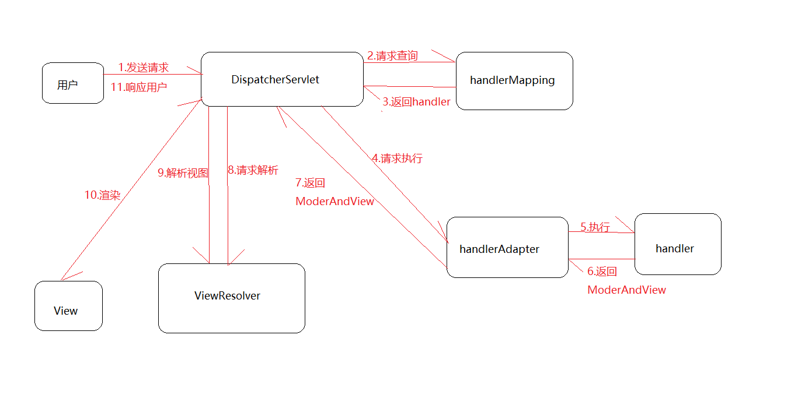
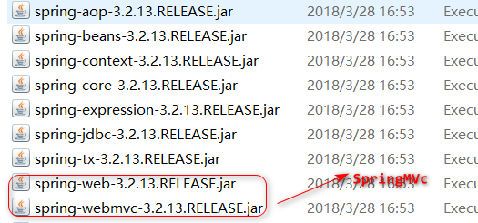

# SpringMVC
## 认识SpringMVC
一种基于Java的实现了Web MVC设计模式的请求驱动类型的轻量级Web框架，使用了MVC架构模式的思想
## 工作原理
+ springmvc的工作原理:
  + 用户发送请求到前端控制器(DispatcherServlet)
  + 请求查询Hander(HanderMapping)
  + 返回(DispatcherServlet)
  + 请求执行(HanderAdapter)
  + 执行(Hander)
  + 返回ModelAndView(HanderAdapter)
  + 返回ModelAndView(DispatcherServlet)
  + 请求解析视图(ViewResolver)
  + 返回View(DispatcherServlet)
  + 渲染视图
  + 响应用户(DispatcherServlet)




## 常用的注解
+ SpringMVC常用注解
  + `@PathVariable`:将URL中查询参数绑定到处理方法参数上,URL上的样子:`http://host:port/path/参数值`
```java
@RequestMapping(value="/users/{userId}")
public String index(@PathVariable(value="userId") int uId){
/*@PathVariable注解就是将url上的变量值绑定到方法参数上去
假设url为: /users/{1002},那么方法参数userId=1002
如果方法参数名与uri变量名不一致,则要在@PathVariable("uri_name")指定uri变量名*/
return "";
}
```

+ `@RequestMapping`:用来处理地址映射的注解,用于方法/类上,6个参数:
1) ==value== : 指定请求的实际地址
2) ==method== : 指定请求的method类型,GET,POST,PUT,DELETE等  
```java
@RequestMapping(value="/testParams",method={RequestMethod.GET,RequestMethod.delete})
public String testMethod(){
return "";
```
3) consums : 指定处理请求的提交内容类型(Content-Type),如Application/json,text/html  
4) produces : 指定返回的内容类型,仅当request请求头中的(Accept)类型中包含该指定类型才返回
5) params : 指定request中必须包含某些参数值时,才使用该方法处理
```java
@RequestMapping(value="/testParams",params={"param1=query","param2","!params"})
   	public String testMethod(){
   	 	//只有当参数param1的值必须为query,参数param2存在,
		//值无所谓,参数params不存在时才能调用此方法
		return "";
}
```
6) headers : 指定request中必须包含某些指定的header值,才让该方法处理请求	
```java
@RequestMapping(value="/testParams",headers={"host=localhost","Accept"})
   	 public String testHeaders(){
		 	//只有当请求头包含Accept信息,且请求的host为localhost才能访问此方法
		 	return "";
		 }
```

+  `@Resource`和`@AutoWired`:bean注入时使用,
1) 共同点:
写在字段或setter方法上,字段上不要写setter方法
2) 不同点:
`@Resource`属于Java,即包javax.annotation.Resource,默认按照ByName自动注入,有2个属性,name和type.name属性解析bean的名字,type属性解析bean的类型,如果不指定类型,将通过反射机制使用byName自动注入.另外,最好将@Resource放在setter方法上,更符合面向对象思想
`@AutoWired`:按照类型（byType）装配依赖对象，默认情况下它要求依赖对象必须存在，如果允许null值，可以设置它的required属性为false。如果我们想使用按照名称（byName）来装配，可以结合`@Qualifier`注解一起使用。

+ `@RequestParam`: 将request请求的参数绑定到controller方法参数里,URL样子:`http://host:port/path?参数名=参数值`;等价于`request.getparameter("name")`,`@RequestParam`中的默认参数和表单中控件的name属性保持一致,它有4个常用参数:
1) **defaultValue**: 设置默认值
2) **required**: boolean类型,设置参数是否是必须要传入,默认true
3) **value:**跟name一样的作用，是name属性的一个别名
4) **name**:绑定本次参数的名称，要跟URL上面的一样  
	
+ `@ResponseBody`:用于将Controller的方法返回的对象，通过适当的HttpMessageConverter转换为指定格式后，写入到Response对象的body数据区.使用时机：返回的数据不是html标签的页面，而是其他某种格式的数据时（如json、xml等）使用；
+ `@RequestBody`:常用来处理Content-Type
```javascript
	    $.ajax({
	        url:"/login",
	        type:"POST",
	        data:'{"userName":"admin","pwd","admin123"}',
	        contentType:"application/json charset=utf-8",
	        success:function(data){
	          alert("request success ! ");
	        }
	    });
```
```java
@RequestMapping(value = "/something", method =RequestMethod.PUT) 
public void handle(@RequestBody String userName, @RequestBody String pwd) throws IOException {  
    /*如果一个User对象有那2个参数,可以写成 @RequestBody User user  			属性与前端的参数一样*/
   } 
```

+ `@Component`: 相当于通用注解,当不知道一些类归属到那些层时使用,不建议使用
+ `@Repository`:用于注解dao层,在daoImpl类上注解
+ `@ModelAttribute`:传递数据,@ModelAttribute标注在方法上或Controller方法参数上.标记在方法上,该方法将在处理器方法执行之前执行,返回的对象存放在模型属性中
```java
@ModelAttribute("ma")
public String getModel(){
 //@ModelAttribute标注在方法上,key="ma"
  return "hello";
}
@RequestMapping(value="/testModel")
public void sayHello(@ModelAttribute("ma") String str){
  //代码块
}
```

+ `@SessionAttribute`:用来绑定HttpSession中的attribute对象的值，便于在方法中的参数里使用。该注解有value、types两个属性，可以通过名字和类型指定要使用的attribute 对象     
+ `@RequestHeader`:
+ `@CookieValue`:

## RestFul风格

|      |     URI      |  Method   | 解释                      |
| :--: | :----------: | :-------: | :------------------------ |
| 新增 |   /create    |   POST    | 创建一个资源              |
| 删除 | /delete/{id} |  DELETE   | 删除资源                  |
| 修改 |  /edit{id}   | PUT/PATCH | 更新资源(完整)/(部分属性) |
| 查询 |   /query/    |    GET    | 获取资源                  |
## 整合项目[^ssm]
[^ssm]:  Spring + SpringMVC + MyBatis
### 1.导入jar包



### 2. 配置文件xml
> spring-application.xml
```xml
<?xml version="1.0" encoding="UTF-8"?>
<beans xmlns="http://www.springframework.org/schema/beans"
	   xmlns:xsi="http://www.w3.org/2001/XMLSchema-instance" 
	   xmlns:aop="http://www.springframework.org/schema/aop"
	   xmlns:context="http://www.springframework.org/schema/context" 
	   xmlns:tx="http://www.springframework.org/schema/tx"
	   xmlns:mvc="http://www.springframework.org/schema/mvc"
	   xsi:schemaLocation="http://www.springframework.org/schema/aop 
		http://www.springframework.org/schema/aop/spring-aop-4.0.xsd
		http://www.springframework.org/schema/mvc 
		http://www.springframework.org/schema/mvc/spring-mvc-4.0.xsd
		http://www.springframework.org/schema/beans
		http://www.springframework.org/schema/beans/spring-beans-4.0.xsd
		http://www.springframework.org/schema/tx  
		http://www.springframework.org/schema/tx/spring-tx-4.0.xsd
		http://www.springframework.org/schema/context 
		http://www.springframework.org/schema/context/spring-context-4.0.xsd">

	<!-- 加入组件自动扫描路径 -->
		<context:component-scan base-package="com.etc.myssm"></context:component-scan>

	<!-- 创建bean的方式来完成jdbc的数据库属性文件的使用 -->

	<bean	class="org.springframework.beans.factory.config.PropertyPlaceholderConfigurer">
		<property name="location" value="classpath:database.properties"></property>
	</bean>

<!-- 写在这里也行,或者引入 -->
<import resource="mybatis-Config.xml"/>

</beans>
```
> springmvc.xml
```xml
<?xml version="1.0" encoding="UTF-8"?>
<beans xmlns="http://www.springframework.org/schema/beans"
	xmlns:xsi="http://www.w3.org/2001/XMLSchema-instance"
	xmlns:p="http://www.springframework.org/schema/p"
	xmlns:mvc="http://www.springframework.org/schema/mvc" 
	xmlns:context="http://www.springframework.org/schema/context"
	xsi:schemaLocation="http://www.springframework.org/schema/beans
	http://www.springframework.org/schema/beans/spring-beans-4.0.xsd
	http://www.springframework.org/schema/context
	http://www.springframework.org/schema/context/spring-context-4.0.xsd
	http://www.springframework.org/schema/mvc
	http://www.springframework.org/schema/mvc/spring-mvc-4.0.xsd">

	<!-- 扫描注解控制器 -->
	<context:component-scan base-package="com.etc.controller" />

	<!-- SpringMVC环境设置 -->
	<mvc:annotation-driven conversion-service="myConversionService">
		<!-- ajax中文乱码问题 -->
		<mvc:message-converters>
			<bean class="org.springframework.http.converter.StringHttpMessageConverter">
				<property name="supportedMediaTypes">
					<list>
						<value>application/json;charset=UTF-8</value>
					</list>
				</property>
			</bean>
			<!-- 日期格式转换 ：Ajax读日期格式转换-->
			<bean
				class="com.alibaba.fastjson.support.spring.FastJsonHttpMessageConverter">
				<property name="supportedMediaTypes">
					<list>
						<value>text/html;charset=UTF-8</value>
						<value>application/json</value>
					</list>
				</property>
				<property name="features">
					<list>
						<!-- FastJSON的Date格式转换器 -->
						<value>WriteDateUseDateFormat</value>
					</list>
				</property>
			</bean>
		</mvc:message-converters>
	</mvc:annotation-driven>

	<!-- 自定义字符串日期格式转换：表单提交到SpringMVC自动绑定格式 -->
	

	<!-- 配置多视图解析器 -->
	<bean class="org.springframework.web.servlet.view.ContentNegotiatingViewResolver">
		<property name="favorParameter" value="true" />
		<property name="defaultContentType" value="text/html" />
		<property name="mediaTypes">
			<map>
				<entry key="html" value="text/html;charset=UTF-8" />
				<entry key="json" value="application/json;charset=UTF-8" />
				<entry key="xml" value="application/xml;charset=UTF-8" />
			</map>
		</property>
		<property name="viewResolvers">
			<list>
				<bean
					class="org.springframework.web.servlet.view.InternalResourceViewResolver">
					<property name="prefix" value="/WEB-INF/jsp/" />
					<property name="suffix" value=".jsp"></property>
				</bean>
			</list>
		</property>
	</bean>

	<!-- SpringMVC静态资源引用 -->
	<mvc:resources location="/statics/" mapping="/statics/**" />

	<!-- SpringMVC全局异常处理 -->
	<bean
		class="org.springframework.web.servlet.handler.SimpleMappingExceptionResolver">
		<property name="exceptionMappings">
			<props>
				<prop key="java.lang.RuntimeException">syserror</prop>
				<!-- syserror：错误信息导航逻辑视图 ，显示异常信息 -->
				<!-- 可以定义多个异常 -->
			</props>
		</property>
	</bean>

	<!-- 配置MultipartResolver，用于上传文件，使用spring的CommonMultipartResolver -->
	<bean id="multipartResolver"
		class="org.springframework.web.multipart.commons.CommonsMultipartResolver">
		<!-- 上传文件大小，单位为字节 -->
		<property name="maxUploadSize" value="500000" />
		<!-- 请求编码格式，设置为和jsp页面编码格式一致，确保SpringMVC正确读取表单内容 -->
		<property name="defaultEncoding" value="UTF-8" />
	</bean>
</beans>
```

> mybatis-config.xml
```xml
<?xml version="1.0" encoding="UTF-8"?>
<beans xmlns="http://www.springframework.org/schema/beans"
	xmlns:xsi="http://www.w3.org/2001/XMLSchema-instance"
	xmlns:aop="http://www.springframework.org/schema/aop"
	xmlns:tx="http://www.springframework.org/schema/tx"
	xsi:schemaLocation="http://www.springframework.org/schema/beans http://www.springframework.org/schema/beans/spring-beans-4.0.xsd
		http://www.springframework.org/schema/aop http://www.springframework.org/schema/aop/spring-aop-4.0.xsd
		http://www.springframework.org/schema/tx http://www.springframework.org/schema/tx/spring-tx-4.0.xsd">
		
		
		
 <!-- 配置数据源，以前用的是dbcp ,现在使用的是alibaba的Druid(德鲁伊)数据源 -->
    <bean name="dataSource" class="com.alibaba.druid.pool.DruidDataSource" init-method="init" destroy-method="close">
       <property name="driverClassName" value="${jdbc_driver}" />
        <property name="url" value="${jdbc_url}" />
        <property name="username" value="${jdbc_username}" />
        <property name="password" value="${jdbc_password}" />
        
        <!-- 初始化连接大小 -->
        <property name="initialSize" value="0" />
        <!-- 连接池最大使用连接数量 -->
        <property name="maxActive" value="20" />
        <!-- 连接池最大空闲 -->
       <!--  <property name="maxIdle" value="20" /> -->
        <!-- 连接池最小空闲 -->
        <property name="minIdle" value="0" />
        <!-- 获取连接最大等待时间 -->
        <property name="maxWait" value="60000" />
        <!-- 配置间隔多久才进行一次检测，检测需要关闭的空闲连接，单位是毫秒 -->
        <property name="timeBetweenEvictionRunsMillis" value="60000" />
        <!-- 配置一个连接在池中最小生存的时间，单位是毫秒 -->
        <property name="minEvictableIdleTimeMillis" value="25200000" />
        <!-- 打开removeAbandoned功能 -->
        <property name="removeAbandoned" value="true" />
        <!-- 1800秒，也就是30分钟 -->
        <property name="removeAbandonedTimeout" value="1800" />
        <!-- 关闭abanded连接时输出错误日志 -->
        <property name="logAbandoned" value="true" />
        <!-- 监控数据库 -->
        <!-- <property name="filters" value="stat" /> -->
        <property name="filters" value="mergeStat" />
    </bean>
    
 
    <!-- 配置sqlSessionFactory -->
    <bean id="sqlSessionFactory" class="org.mybatis.spring.SqlSessionFactoryBean">
        <!-- 实例化sqlSessionFactory时需要使用上述配置好的数据源以及SQL映射文件 -->
        <property name="dataSource" ref="dataSource" />
        <property name="mapperLocations" value="classpath:com/xlx/jdbc/dao/*.xml" />
    </bean>
    <!-- 配置扫描器 -->
    <bean class="org.mybatis.spring.mapper.MapperScannerConfigurer">
        <!-- 扫描me.gacl.dao这个包以及它的子包下的所有映射接口类 -->
        <property name="basePackage" value="com.xlx.jdbc.dao" />
        <property name="sqlSessionFactoryBeanName" value="sqlSessionFactory" />
    </bean>
    
   <!-- 配置Spring的事务管理器 -->
    <bean id="transactionManager" class="org.springframework.jdbc.datasource.DataSourceTransactionManager">
        <property name="dataSource" ref="dataSource" />
    </bean>

    <!-- 注解方式配置 事务-->
    <tx:annotation-driven transaction-manager="transactionManager" /> 
    
    <!-- 配置druid监控spring jdbc -->
    <bean id="druid-stat-interceptor" class="com.alibaba.druid.support.spring.stat.DruidStatInterceptor">
    </bean>
    <bean id="druid-stat-pointcut" class="org.springframework.aop.support.JdkRegexpMethodPointcut" scope="prototype">
        <property name="patterns">
            <list>
                <value>com.xlx.jdbc.service.*</value>
            </list>
        </property>
    </bean>
    <aop:config>
        <aop:advisor advice-ref="druid-stat-interceptor" pointcut-ref="druid-stat-pointcut" />
    </aop:config>
</beans>
```
### 3.properties属性文件
> 数据库配置 db.properties
```properties
# key =value形式,注意末尾不能有空格哦
driver=com.mysql.jdbc.Driver
url=jdbc:mysql://localhost:3306/smbms?useUnicode=true&characterEncoding=utf8
username=mango
password=root5.7.22
```
> 日志配置 log4j.properties

### 4. 使用MyBatis的自动生成
MyBatis的自动生成entity,dao,mapper(xml)
### 5. 测试
#### 5.1 Springc测试
#### 5.2 MyBatis测试
### 6.添加Tomacat容器 
### 7. 运行


