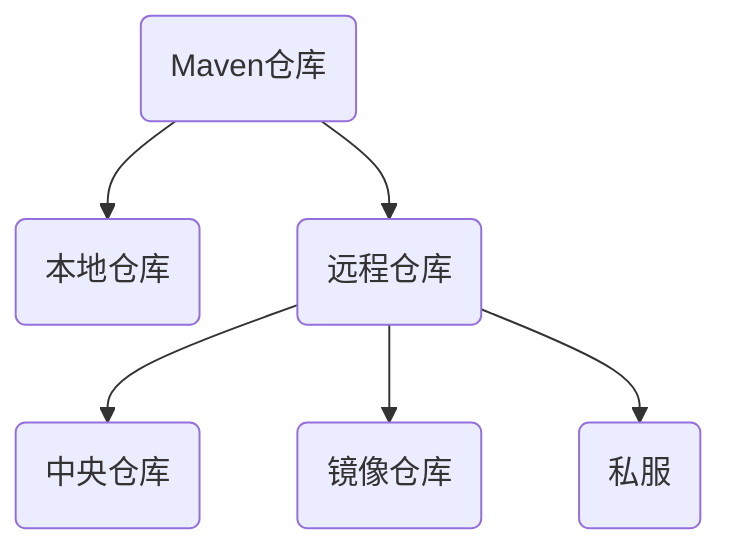

## Maven[^maven]
[^maven]: 美[ˈmeɪvn],n,专家,内行

#### Maven仓库分类


#### Maven下载&安装
+ 下载地址: [http://maven.apache.org/download.cgi](http://maven.apache.org/download.cgi)
+ 下载.zip压缩包,解压
+ 配置环境变量: `我的电脑`\-\>`属性`\-\>`高级系统设置`\-\>`指到\bin路径下`
#### 使用阿里云镜像
+ 先备份/conf/setting.xml文件
+ 更改/conf/setting.xml文件
+ 找到`<mirrors>`和`<localRepository>`标签
```xml
<!-- jar包放置路径 -->
<localRepository>F:\Maven\repository</localRepository>

<!-- 阿里云镜像 -->
<mirrors>
	<mirror>
		<!--This sends everything else to /public -->
		<id>nexus-aliyun</id>
        <mirrorOf>*</mirrorOf>
        <name>Nexus aliyun</name>
		<url>http://maven.aliyun.com/nexus/content/groups/public/</url>
	</mirror>
	<!-- 快照 -->
	<mirror>
		<id>nexus-public-snapshots</id>
		<mirrorOf>public-snapshots</mirrorOf>
		<url>http://maven.aliyun.com/nexus/content/repositories/snapshots/</url>
	</mirror>
```
#### 搭建Maven私服[^nexus]
[^nexus]: 美[ˈneksəs] n,(错综复杂的)关系,联系

+ 下载地址:[https://www.sonatype.com/download-oss-sonatype](https://www.sonatype.com/download-oss-sonatype)
+ 